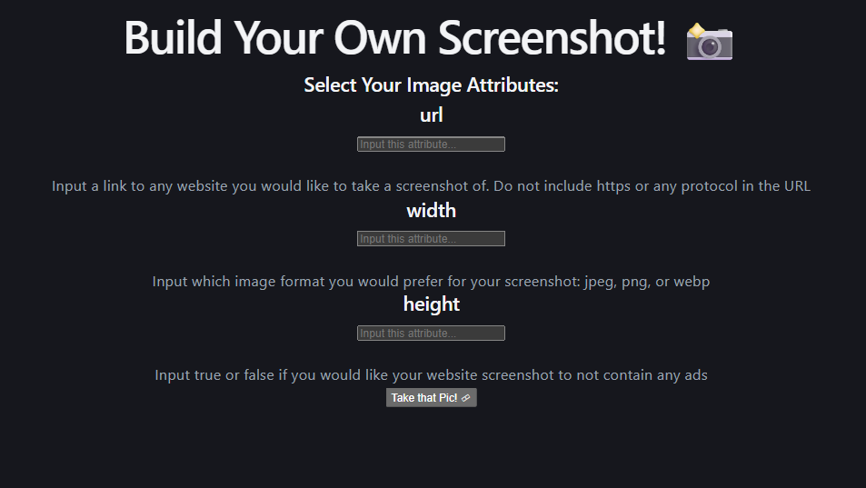
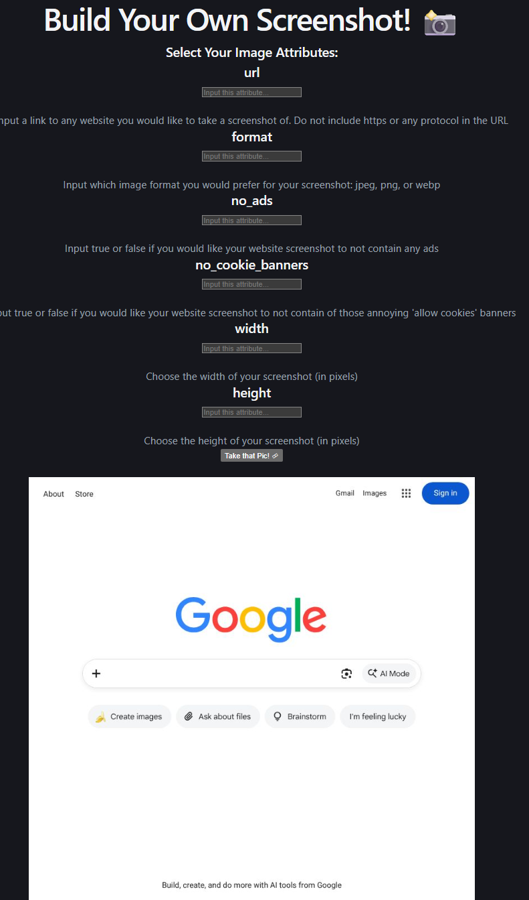
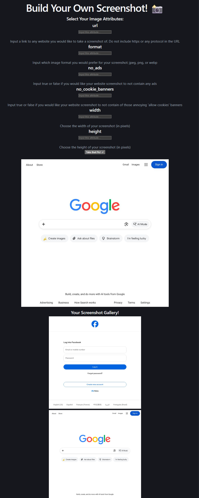
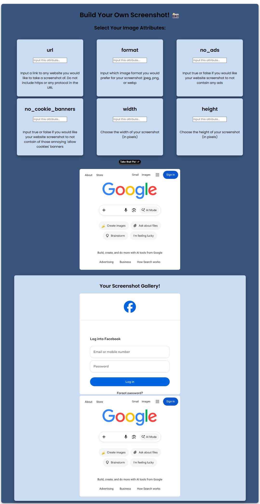

# Lab4: Cap

## Overview

Cap! uses the ApiFlash API to take screenshots of any website with the parameters you choose. You'll make a static API call with async/await, save the result to state, and build an interface that lets users set their own query parameters and collect the screenshots they take.

## Step1: Create form for user input on the screenshot attributes

In this step we'are going to create a form to help user set up the base qualities of their screenshot. The Cap app will be able to collect different parameters given to it such as url, width and height.

## Step 2: Make the query with the user input, create an API call, and display your screenshot

In this step we'are going to collect user inputs, do some input and error handling, make the ApiFlash API call, and display the returned image.

## Step 3: Create gallery for displaying previous screenshots

In this step we'are going to add a gallery of the previous screenshots so we can keep track of every site we've seen, saving the images in a state array and displaying them at the bottom of the page.

## Step 4: CSS styling

